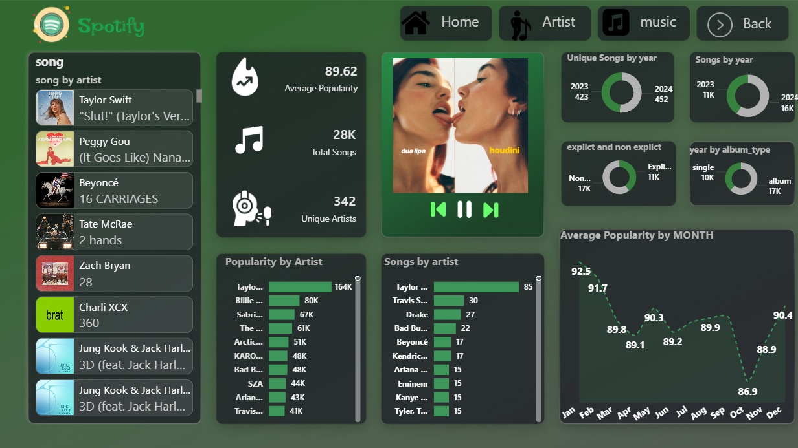

# 🎧 Spotify Music Analytics Dashboard

An interactive **Spotify Music Analytics Dashboard** built to analyze song popularity, artist performance, and music trends over time. The dashboard provides actionable insights through an intuitive, Spotify-inspired visual design.

---

## 📌 Project Overview

This project analyzes Spotify music data to uncover trends related to:
- Song popularity
- Artist dominance
- Release patterns across years
- Explicit vs non-explicit content
- Album vs single distribution

The dashboard enables users to explore data dynamically and gain meaningful insights for decision-making in music analytics and digital media strategy.

---

## 📊 Key Insights

- **Average Popularity:** 89.62  
- **Total Songs Analyzed:** 28,000+  
- **Unique Artists:** 342  

---

## 🚀 Features

### 🎼 Music & Artist Analysis
- Popularity distribution by artist
- Number of songs per artist
- Song-level filtering with album artwork display

### 📈 Trend Analysis
- Average popularity by month
- Songs released by year
- Unique songs growth year-over-year

### 🔞 Content Insights
- Explicit vs non-explicit song comparison
- Album type analysis (Single vs Album)

### 🎨 Interactive Dashboard
- Spotify-themed dark UI
- Dynamic slicers & filters
- User-friendly navigation and visuals

---

## 🛠 Tools & Technologies

- **Power BI**
- **Power Query** (Data Cleaning & Transformation)
- **DAX** (KPIs & Measures)
- **Data Visualization & Analytics**

---

## 📂 Dataset

- Spotify song metadata  
- Artist information  
- Popularity scores  
- Release dates & album types  

*(Dataset used for learning and analytical purposes)*

---

## 📷 Dashboard Preview

---

## 💡 Business Use Cases

- Identify top-performing artists and songs
- Analyze seasonal popularity trends
- Understand content strategy (explicit vs clean)
- Support data-driven decisions in music marketing

---

## 📈 Learning Outcomes

- Advanced Power BI dashboard design
- DAX-based KPI calculations
- Interactive visual storytelling
- Real-world analytics problem solving

---

## 🤝 Connect With Me

**Rahul N**  
📧 Email: rahulmckel5@gmail.com  
🔗 LinkedIn: https://linkedin.com/in/rahul-nmckel5  
 

---

⭐ If you like this project, feel free to star the repository!
